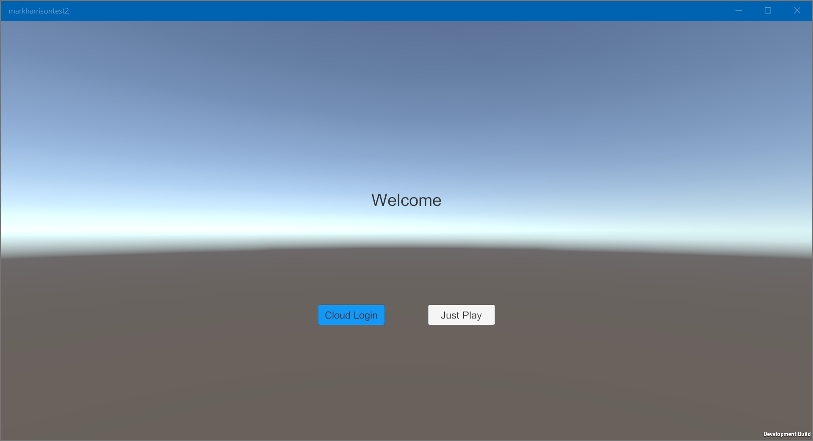
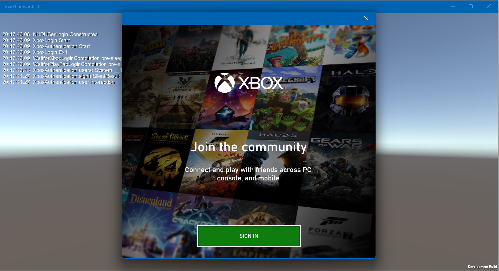
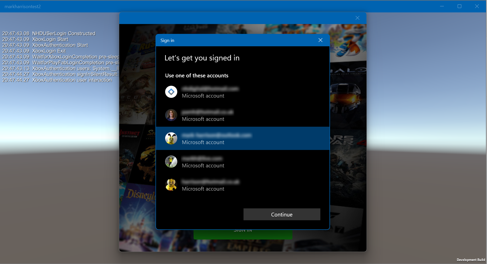
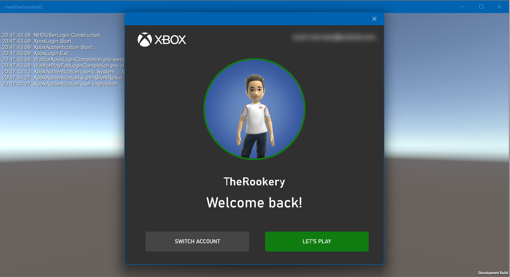
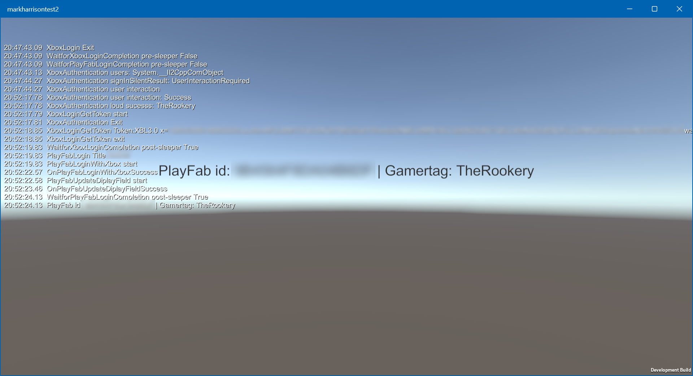
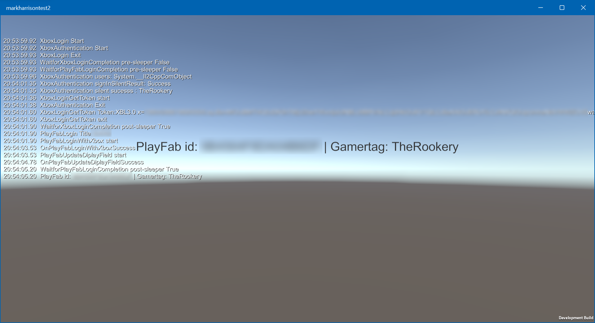
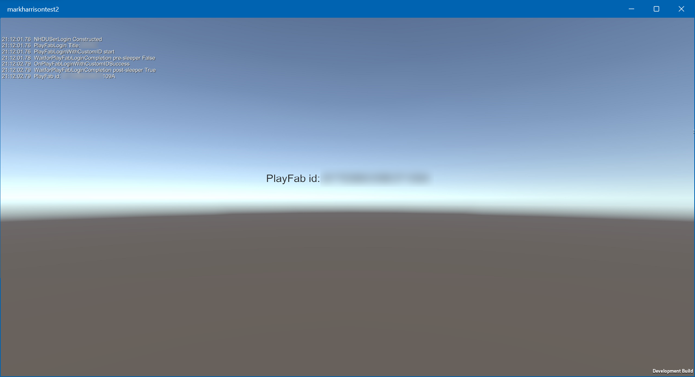

# Xbox PlayFab Unity

Unity script. Logon to PlayFab - using Gamertag if on Xbox.

## How to use with Unity editor

Install PlayFab manually

- Download https://aka.ms/PlayFabUnitySdk

- Install unity package 

- In your Unity Project tab, navigate to: assets/PlayFabSDK/Shared/Public/Resources and select the PlayFabSharedSettings ScriptableObject.   
  - Set TitleId  

Add assets from this repo
  - Scripts x 3
  - xboxservices.config  - config this with appropriate values for Xbox application
  - Microsoft.Xbox.Services.winmd - also available from here <https://aka.ms/xboxlivesdkunit>
  - Scene - CloudLoginScene.unity

Check it plays ok in the Unity editor 

Switch platform to Universal Windows Platform - project / application from Unity  
- Select build 14393 or later in the Minimum Version dropdown. Select the latest SDK in the Target Version dropdown.  
- Optional enable the Development checkbox to enable logging.

In Visual Studio, with the the built UWP application:

- Add Nuget Install-Package Microsoft.Xbox.Live.SDK.WinRT.UWP

- Ensure xboxservices.config is in project and 'copied to' in  build

- UWP permissions give network access 

- Build package / associate to store item

## Screenshots

### With Xbox - Loud Login 

### With Xbox - Silent Login 

### Not Xbox

